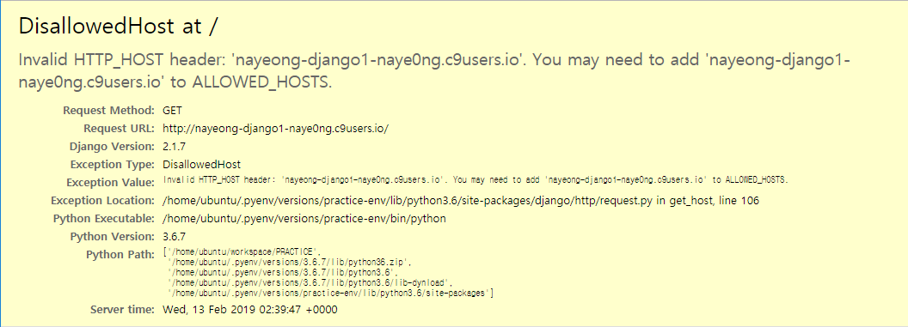
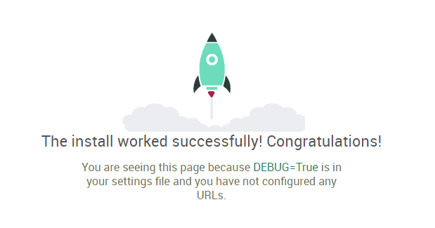

## Django

#### MTV

Djang의 패턴

- M(model) : 데이터를 관리
- T(template) : 사용자가 보는 화면
- V(view) : 중간 관리자, 컨트롤러, 제일 중요함

view로 요청이 들어오면 view는 model에게 관련 데이터를 받아와 template에게 해당 데이터를 사용자에게 보여주도록 명령한다.


#### 1. 환경설정

```shell
# pyenv : 서로 다른 종류의 python버전을 관리함, 여러개의 python버전을 사용할 수 있게 함
# pyenv install
git clone https://github.com/pyenv/pyenv.git ~/.pyenv
echo 'export PYENV_ROOT="$HOME/.pyenv"' >> ~/.bashrc
echo 'export PATH="$PYENV_ROOT/bin:$PATH"' >> ~/.bashrc
echo -e 'if command -v pyenv 1>/dev/null 2>&1; then\n  eval "$(pyenv init -)"\nfi' >> ~/.bashrc

# shell reload
exec "$SHELL"

# pyenv-virtualenv install
git clone https://github.com/pyenv/pyenv-virtualenv.git $(pyenv root)/plugins/pyenv-virtualenv
echo 'eval "$(pyenv virtualenv-init -)"' >> ~/.bashrc
exec "$SHELL"

# pyenv를 이용하여 python3.6.7 설치
pyenv install 3.6.7

# python 버전 등록
pyenv global 3.6.7

# python 버전확인
python --version

# 프로젝트를 진행할 폴더 생성 및 이동
mkdir PRACTICE
cd PRACTICE

# pyenv에게 python3.6.7버전의 가상환경을 생성한다.
pyenv virtualenv 3.6.7 practice-venv

# 현재 폴더를 가상화하여 독립된 공간으로 만든다.
pyenv local practice-venv

# 가상환경안에 django 설치
# 여기서 중요한 점은 pyenv virtualenv로 독립된 가상환경을 만들었으므로 해당 폴더 안에서만 django가 설치됨.
pip install django

# 현재 디렉토리에 practice라는 이름의 프로젝트를 생성해라
# 현재 위치에 여러 파일(프로젝트)이 자동으로 생성된 것을 확인할 수 있다.
django-admin startproject practice .

# tree명령어로 하위 목록을 확인해보자
tree
.
├── manage.py
└── practice
    ├── __init__.py
    ├── settings.py
    ├── urls.py
    └── wsgi.py

# 서버 구동
# $IP:$PORT는 c9에서 실행시킬때 c9의 포트와 매핑하기 위해 사용
python manage.py runserver $IP:$PORT
```



> settings.py 설정
>
> ```python 
># 현재 실행 주소가 'https://nayeong-django1-naye0ng.c9users.io/'라면 아래와 같이 넣음 
>ALLOWED_HOSTS = ['nayeong-django1-naye0ng.c9users.io']
>
># 현재 시간 설정
>TIME_ZONE = 'Asia/Seoul'
>
># 언어 설정
># 장고는 i18n (=internationalization)를 지원한다.
>LANGUAGE_CODE = 'ko-kr'
> ```
>
>
>


#### 2. Django 프로젝트 

1. 프로젝트 앱 생성

```shell
# pages라는 이름의 앱을 실행시키겠다.
python manage.py startapp pages

# pages라는 디렉토리와 파일들이 생성된다.
.
├── db.sqlite3
├── manage.py
├── pages
│   ├── __init__.py
│   ├── admin.py
│   ├── apps.py
│   ├── migrations
│   │   └── __init__.py
│   ├── models.py
│   ├── tests.py
│   └── views.py
└── practice
    ├── __init__.py
    ├── __pycache__
    │   ├── __init__.cpython-36.pyc
    │   ├── settings.cpython-36.pyc
    │   ├── urls.cpython-36.pyc
    │   └── wsgi.cpython-36.pyc
    ├── settings.py
    ├── urls.py
    └── wsgi.py
```

>```python
>"""
>setting.py
>
>- 위에서 생성한 pages앱을 Django에게 추가한다.
>- pages 앱의 경로는 써주지 않아도 알아서 받아옴
>[주의] 항상 뒤에 ,를 찍어줘야 한다.
>"""
>INSTALLED_APPS = [
>    'django.contrib.admin',
>    ...
>    'django.contrib.staticfiles',
>    'pages',
>]
>```

2. views.py 설정

```python
"""
views.py
"""
from django.shortcuts import render
import datetime
import requests
import random 
import urllib.request
import json
import os

# Create your views here.
def index(request):
    context = {'msg':'hello','name':'nayeong'}
    return render(request, 'index.html',context)

# /isvql/
def isval(request) :
    dt = datetime.datetime.now()
    answer = False
    if dt.month == 2 and dt.day == 14 :
        answer = True
    context = {'isval' : answer}
    return render(request,'isval.html',context)
    

def cube(request, number):
    #사용자로부터 url로 입력받은 값을 세제곱한다.
    result = number**3
    return render(request,'cube.html',{'result':result})

# 펠린드롭 판별
def ispal(request,text) :
    result = False
    if text == text[::-1] :
        result = True
    return render(request, 'ispal.html',{'result':result})
    
    
def image(request):
    return render(request,'image.html')
    

# 사용자의 입력을 받을 페이지
def word(request) :
    return render(request, 'word.html')
    
    
# artii api를 통해 ascii  아트로 변환하여 보여주는 페이지
def artii(request) :
    word = request.GET.get('word')
    
    # 폰트 랜덤으로 생성
    URL = 'http://artii.herokuapp.com/fonts_list'
    font = random.sample(requests.get(URL).text.split(),1)[0]

    # artii api를 통해 ascii 아트로 변환
    URL = 'http://artii.herokuapp.com/make?text={}&font={}'.format(word, font)
    result = requests.get(URL).text

    return render(request,'artii.html',{'result': result})
    

# /papago
# 사용자로부터 단어를 입력받아 /result로 넘겨준다.
def papago(request) :
    return render(request,'papago.html')

# /result
# papago api를 사용하여 번역결과 보여줌
def result(request) :
    word = request.GET.get('word')
    
    client_id = os.getenv('NAVER_ID')
    client_secret = os.getenv('NAVER_SECRET')
    
    data = "source=ko&target=en&text=" + word
    url = "https://openapi.naver.com/v1/papago/n2mt"
    
    print(client_id,client_secret)
    
    req = urllib.request.Request(url)
    req.add_header("X-Naver-Client-Id",client_id)
    req.add_header("X-Naver-Client-Secret",client_secret)
    response = urllib.request.urlopen(req, data=data.encode("utf-8"))
    rescode = response.getcode()
    if(rescode==200):
        result = json.loads(response.read().decode('utf-8'))['message']['result']['translatedText']
    else:
        print("Error Code:" + rescode)

    return render(request, 'result.html', {'result':result})
```

>- 플라스크와 마찬가지로 templates폴더에 랜더할 html페이지 작성
>
>```html
><!DOCTYPE html>
><html lang="en">
><head>
>    <meta charset="UTF-8">
>    <meta name="viewport" content="width=device-width, initial-scale=1.0">
>    <meta http-equiv="X-UA-Compatible" content="ie=edge">
>    <title>Document</title>
></head>
><body>
>    <h1>First Django!</h1>
>    <h3>{{ name }}</h3>
></body>
></html>
>```
>
>- tree를 찍어보면 pages의 구조는 다음과 같다.
>
>```shell
>.
>├── __init__.py
>├── __pycache__
>│   ├── __init__.cpython-36.pyc
>│   ├── admin.cpython-36.pyc
>│   ├── models.cpython-36.pyc
>│   └── views.cpython-36.pyc
>├── admin.py
>├── apps.py
>├── migrations
>│   ├── __init__.py
>│   └── __pycache__
>│       └── __init__.cpython-36.pyc
>├── models.py
>├── templates
>│   ├── artii.html
>│   ├── cube.html
>│   ├── image.html
>│   ├── index.html
>│   ├── ispal.html
>│   ├── isval.html
>│   ├── papago.html
>│   ├── result.html
>│   └── word.html
>├── tests.py
>└── views.py
>```

3. URL  설정

- request가 들어왔을때 urls.py를 걸쳐서 원하는 view(관리자)를 연결한다.
- django에서 루트 경로는 '/'이 아니라 ''이다.

```python
"""
urls.py
"""
from django.contrib import admin
from django.urls import path

# urls는 views를 찾지 못하므로 추가해준다.
from pages import views

# path(url, 해당요청을 다룰 view함수) 형식으로 작성
# ,쓰는 것 잊지 말기
urlpatterns = [
    path('admin/', admin.site.urls),
    path('',views.index),
    path('isval/',views.isval),
    path('cube/<int:number>/',views.cube),
    path('ispal/<str:text>/',views.ispal),
    path('image/',views.image),
    path('artii',views.artii),
    path('word/',views.word),
    path('papago/',views.papago),
    path('result',views.result),
]
```


#### 3. pyenv 가상환경에서 환경변수 설정

```shell
# .bashrc 파일을 열어서 환경변수 설정
c9 ~/.bashrc

# [주의] 가상환경에 접속해있는 터미널에서 적용해야 성공적으로 환경변수가 전달된다.
# .bashrc 변경사항 전달 
source ~/.bashrc

# '환경설정'단계에서 자동으로 가상환경을 만들어주는 코드를 .bashrc에 넣어놨는데 source .bashrc를 하는 순간 가상환경 안에서 다시 가상환경이 중첩해서 만들어진다.
# 중첩된 가상환경에서 빠져나오자!
source deactivate
```


