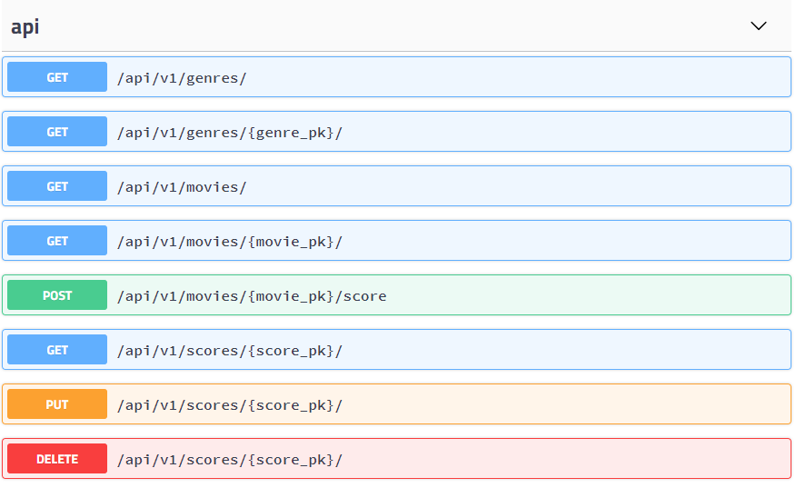

# Django - Rest API 

*2019.05.07*


## 1. django Rest API 환경설정

### 1-1. pyenv-virtualenv, django 설치

```shell
git clone https://github.com/pyenv/pyenv.git ~/.pyenv
echo 'export PYENV_ROOT="$HOME/.pyenv"' >> ~/.bashrc
echo 'export PATH="$PYENV_ROOT/bin:$PATH"' >> ~/.bashrc
echo -e 'if command -v pyenv 1>/dev/null 2>&1; then\n  eval "$(pyenv init -)"\nfi' >> ~/.bashrc
exec "$SHELL"
git clone https://github.com/pyenv/pyenv-virtualenv.git $(pyenv root)/plugins/pyenv-virtualenv
echo 'eval "$(pyenv virtualenv-init -)"' >> ~/.bashrc
exec "$SHELL"
pyenv install 3.6.7
pyenv global 3.6.7

mkdir API
cd API

pyenv virtualenv 3.6.7 api-venv
pyenv local api-venv

# django 버전을 2.1.8로 명시하지 않고 그냥설치하면 release된 2.2 버전이 설치되는데 이는 'django.core.exceptions.ImproperlyConfigured: SQLite 3.8.3 or later is required (found 3.8.2).'와 같은 에러를 발생시킨다.
pip install django==2.1.8

python managy.py startapp movies
```


### 1-2. rest_framework 설치

```shell
pip install djangorestframework
```

```python
# setting.py에 추가
'rest_framework',
```


### 1-3. swagger 설치

swagger는 자동으로 api 문서를 만들어준다.

```shell
pip install django-rest-swagger
```

```python
# setting.py에 추가
'rest_framework_swagger'
```

```python
# urls.py에 swagger로 api문서 만들기
from rest_framework_swagger.views import get_swagger_view
urlpatterns = [
    ...
    path('docs/', get_swagger_view(title="API문서")),
]
```




### 1-4. 전체 url

```python
urlpatterns = [
    path('admin/', admin.site.urls),
    path('api/v1/', include('movies.urls')),
    path('docs/', get_swagger_view(title="API문서")),
]
```


## 2. rest_framework 사용

rest_framework의 사용방법은 modelForm과 유사하다.

### 2-1. serializers.py 

```python
from rest_framework import serializers
from .models import Movie, Genre, Score

class GenreSerializer(serializers.ModelSerializer) :
    class Meta :
        model = Genre
        fields = ['id','name']
        
class MovieSerializer(serializers.ModelSerializer) :
    class Meta :
        model = Movie
        fields = ['title','audience','poster_url','description','genre']
 
# Genre id로 부터 Movie의 내용물도 같이 출력하기 위해 정의한 serializer
class GenreMovieSerializer(serializers.ModelSerializer) :
    movies = MovieSerializer(many=True)
    
    class Meta :
        model = Genre
        fields = ['id','name','movies']
        
class ScoreSerializer(serializers.ModelSerializer) :
    class Meta :
        model = Score
        fields = ['content','score','movie']
```


### 2-2. urls.py

```python
from django.urls import path, include
from . import views

urlpatterns = [
    path('genres/', views.genres, name='genres'),
    path('genres/<int:genre_pk>/', views.genre, name='genre'),
    path('movies/', views.movies, name='movies'),
    path('movies/<int:movie_pk>/', views.movie, name='movie'),
    path('movies/<int:movie_pk>/score', views.movie_score, name='movie_score'),
    path('scores/<int:score_pk>/', views.score, name='score'),
]
```


### 2-3. views.py

```python
from django.shortcuts import render, get_object_or_404
from .models import Movie, Genre, Score

from rest_framework.decorators import api_view
from .serializers import MovieSerializer, GenreSerializer, ScoreSerializer, GenreMovieSerializer
from rest_framework.response import Response
from rest_framework import status


# 허용할 HTTP Method
@api_view(['GET'])
def genres(request) :
    genres = Genre.objects.all()
    serializer = GenreSerializer(genres, many=True)
    # Response는 serializer객체를 json형식으로 변환하여 반환한다.
    return Response(serializer.data)

@api_view(['GET'])
def genre(request, genre_pk) :
    genre = get_object_or_404(Genre, id=genre_pk)
    serializer = GenreMovieSerializer(genre,many=False)
    return Response(serializer.data)

@api_view(['GET'])
def movies(request) :
    movies = Movie.objects.all()
    serializer = MovieSerializer(movies, many=True)
    return Response(serializer.data)

@api_view(['GET'])
def movie(request, movie_pk) :
    movie = get_object_or_404(Movie,pk=movie_pk)
    # many는 여러개의 값을 반환할때 리스트로 변환하는 역할
    # movie 데이터 1개만 반환하는 것이므로 False로 설정한다.
    serializer = MovieSerializer(movie, many=False)
    return Response(serializer.data)

@api_view(['POST'])
def movie_score(request, movie_pk):
    data = request.data.dict()
    data['movie'] = movie_pk

    serializer = ScoreSerializer(data=data)
    # raise_exection 검증 실패시 validation 통과 못함
    if serializer.is_valid(raise_exection=True):
        serializer.save()
        return Response(serializer.data, status=status.HTTP_201_CREATED)
    return Response(serializer.errors, status=status.HTTP_400_BAD_REQUEST)
    
@api_view(['PUT','DELETE'])
def score(request, score_pk) :
    if request.method == 'PUT' :
        score = get_object_or_404(Score, id=score_pk)
        score.score = request.data['score']
        score.save()
        serializer = ScoreSerializer(score,many=False)
        return Response(serializer.data, status=status.HTTP_201_CREATED)
            
    elif request.method == 'DELETE' :
        score = get_object_or_404(Score,id=score_pk)
        serializer = ScoreSerializer(score,many=False)
        score.delete()
        return Response(serializer.data, status=status.HTTP_201_CREATED)
    return Response(serializer.errors, status=status.HTTP_400_BAD_REQUEST)
```

>**AttributeError: *This QueryDict instance* is immutable**
>
>request.data의 데이터 타입은 QueryDict이지만,` immutable`이므로 수정이 불가능하다.
>QueryDict의 `dict()`메서드를 사용하면 `mutable`로 바꿀 수 있다.


