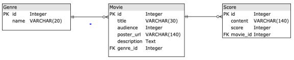
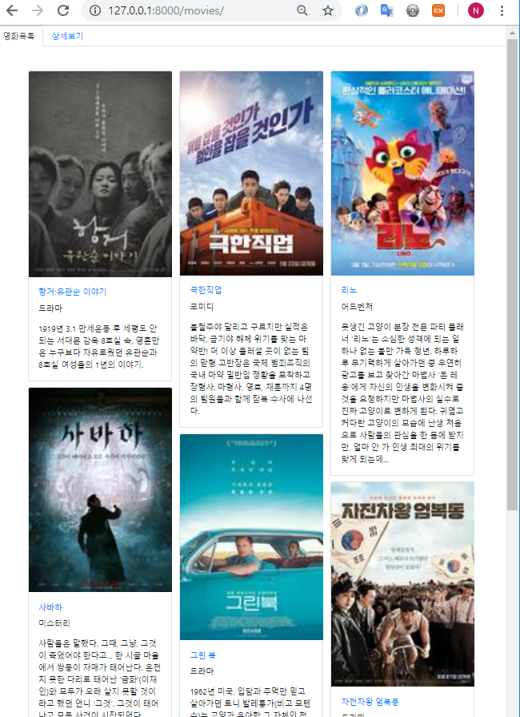
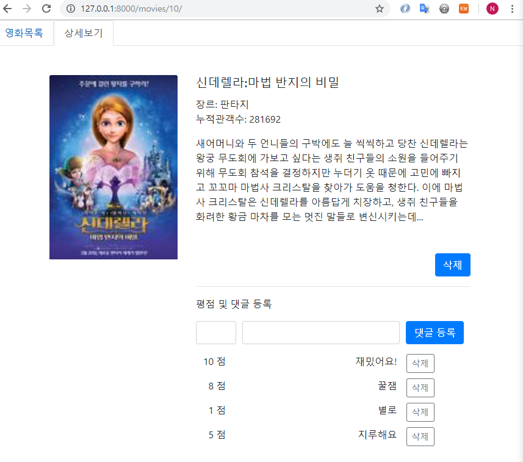

# 영화정보 페이지

Django의 ORM과 Bootstrap을 활용한 데이터 생성 및 삭제 페이지

> **[ Database Schema ]**
>
> 

## 1. movie/ : 영화 목록

- 데이터베이스의 영화목록을 보여주는 반응형 페이지

## 2. movie/{movie_id}/: 영화 정보 조회

- 데이터베이스의 영화, 평점 등을 출력 함

- 댓글 등록 및 삭제, 영화 정보 삭제 기능

